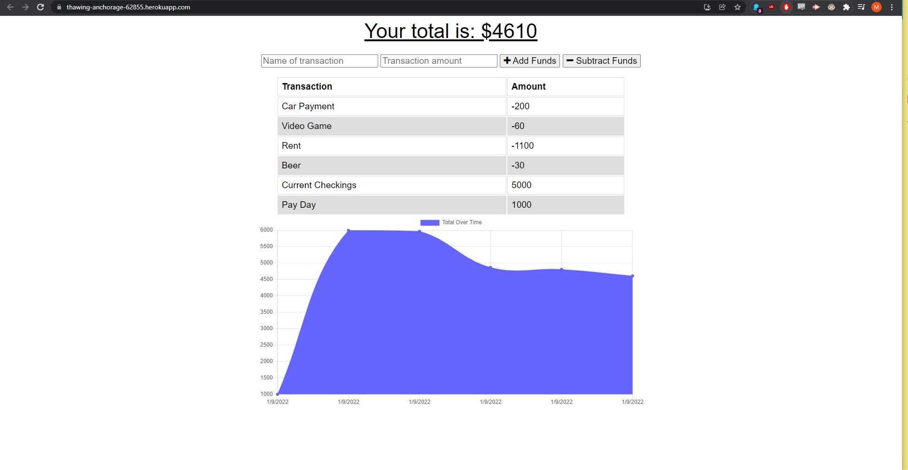

# Budget Tracker

# Description

This application gives users a fast and easy way to track their money. This application will also let you You will be able to add expenses and deposits to your budget with or without an internet connection!

# Table of Contents

1. [Installation](#installation)
2. [Usage](#usage)
3. [Contribution](#contribution)
4. [Questions](#questions)

# Installation Instructions

Follow these instructions to install the application for your specific smartphone OS:

- iOs:

  1. Navigate to [https://thawing-anchorage-62855.herokuapp.com/](https://thawing-anchorage-62855.herokuapp.com/) with Safari.

  2. Tap the Share button in Safari.

  3. Tap the icon labeled Add to Home Screen.

  4. Name the app, then tap Add in the upper-right corner.

  5. Check your Home Screen to see the app.

 

- Android:

  1. Navigate to [https://thawing-anchorage-62855.herokuapp.com/](https://thawing-anchorage-62855.herokuapp.com/) with Chrome.

  2. Tap the menu button in the upper right corner of Chrome.

  3. Tap the icon labeled Add to Home Screen.

  4. Name the app, then tap Add below the prompt.

  5. If there is an additional prompt asking "Add to Home Screen?", tap Add.

  6. Check your Home Screen to see the app.

# Usage Info

1. To track a transaction just fill out the required fields, "Name of transaction" & "Transaction amount".

2. Then click the appropriate button to add or subtract funds. This will submit the transaction.

# Contribution Guidelines

We are not accepting contributors at this time.

# Questions

GitHub Username: [MarkGranade](https://github.com/MarkGranade)

Email: <mark.granade@gmail.com>
